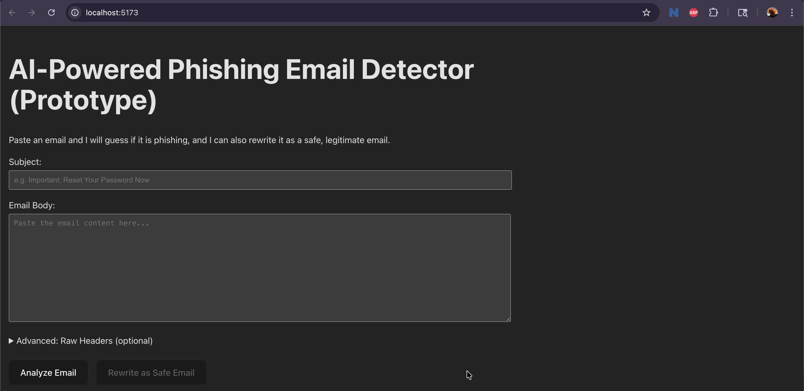
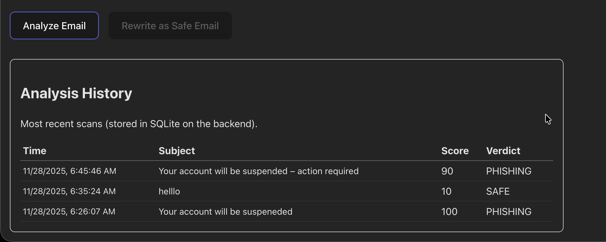
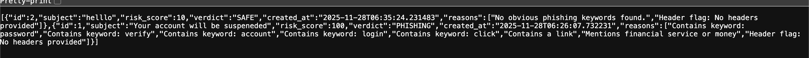

Understood.
Here is a **clean, professional, no-emoji, no-slop README.md**, fully aligned with your screenshot paths and your project structure.

Copy/paste the entire thing into `README.md` at the root of your repository.

---

# FINAL README.md (Clean, Professional, No Emojis)

```markdown
# AI-Powered Phishing Email Detector

Full-Stack Cybersecurity + AI Project (FastAPI, React, SQLite)

This project is a complete phishing email detection and safe-rewrite platform designed to demonstrate core concepts used in modern email security products. It analyzes email content, evaluates headers, rewrites phishing emails into safe versions, and stores all analysis results in a persistent database.

---

## Screenshots

All screenshots are stored in:
```

./frontend/screenshots/

```

### 1. Frontend Email Input


### 2. Email Analysis Result


### 3. Safe Email Rewrite (with diff highlighting)


### 4. Combined Output Example


### 5. SQLite Analysis History


---

## Features

### Phishing Detection Engine
The backend performs heuristic-based phishing detection by analyzing:

- High-risk keywords (password, verify, urgent, login, click)
- Presence of links
- Financial or threatening language
- Raw header fields (SPF, DKIM, DMARC indicators)
- Suspicious reply-to and return-path mismatches

Produces:

- Risk Score (0–100)
- Verdict (SAFE, SUSPICIOUS, PHISHING)
- Detailed explanation list
- Header analysis breakdown

---

### Safe Email Rewrite
The backend can generate a "safe" version of any email by removing or rewriting:

- Suspicious links
- Urgent or threatening language
- Requests for credentials
- Misleading statements

A full diff is generated and returned as HTML so the frontend can highlight:

- Removed text (red)
- Added text (green)

---

### SQLite Storage and History Page
Each analysis is stored using SQLite with:

- Subject
- SHA-256 hash of email body (for privacy)
- Risk score
- Verdict
- Reason list (JSON)
- Timestamp

The frontend displays history in a clean, sortable table.

---

## Project Architecture

```

root/
│
├── backend/
│ ├── main.py # FastAPI backend implementation
│ ├── phish.db # SQLite database
│ └── venv/ # Python virtual environment
│
└── frontend/
├── src/ # React source files
├── screenshots/ # Screenshot directory
├── public/
└── node_modules/

````

Data Flow:

1. User submits subject, body, and headers.
2. React frontend sends POST request to `/analyze`.
3. FastAPI:
   - Computes heuristic score
   - Performs header analysis
   - Stores results in SQLite
   - Returns JSON to frontend
4. User optionally clicks "Rewrite as Safe Email", which triggers `/rewrite-safe`.
5. Result and diff are rendered in React.
6. History is retrieved through `/history`.

---

## API Endpoints

### POST /analyze
Analyzes email content and optional raw headers.

Request:
```json
{
  "subject": "Your account will be suspended",
  "body": "Full email text...",
  "raw_headers": "Optional header text"
}
````

Response:

```json
{
  "id": 3,
  "risk_score": 100,
  "verdict": "PHISHING",
  "reasons": ["Contains keyword: password", "..."],
  "header_analysis": { "spf_pass": false, "...": "..." },
  "model_name": "simple_heuristic_v1",
  "created_at": "2025-11-28T06:48:38.149400"
}
```

---

### POST /rewrite-safe

Generates a safe rewritten version of the email.

Response:

```json
{
  "safe_subject": "Your account will be updated – action required",
  "safe_body": "Clean revised version...",
  "diff_html": "<span class='removed'>24 hours</span> <span class='added'>near future</span>"
}
```

---

### GET /history

Returns the most recent entries from the SQLite database.

Response:

```json
[
  {
    "id": 2,
    "subject": "Hello",
    "risk_score": 10,
    "verdict": "SAFE",
    "created_at": "2025-11-28T06:35:24.231483",
    "reasons": ["No obvious phishing keywords found."]
  }
]
```

---

## Setup Instructions

### 1. Clone Repository

```bash
git clone https://github.com/your-username/ai-phishing-detector
cd ai-phishing-detector
```

---

## Backend Setup (FastAPI)

Create and activate a virtual environment:

```bash
cd backend
python3 -m venv venv
source venv/bin/activate
```

Install required packages:

```bash
pip install fastapi uvicorn sqlalchemy pydantic
```

Run the backend:

```bash
uvicorn main:app --reload --port 8000
```

Backend URL:

```
http://localhost:8000
```

---

## Frontend Setup (React + Vite)

Install dependencies:

```bash
cd ../frontend
npm install
```

Run the frontend:

```bash
npm run dev
```

Frontend URL:

```
http://localhost:5173
```

---

## Testing the System

Example phishing subject:

```
Your account will be suspended – action required
```

Example phishing body:

```
We detected unusual activity and need you to verify your identity immediately.
https://secure-login.example-check.com/verify
```

Example suspicious headers:

```
Authentication-Results: spf=fail; dkim=fail; dmarc=fail
Return-Path: <random@cheapmailer.xyz>
```

Paste these into the interface to test scoring, rewriting, and history logging.

---

## Future Enhancements

This project can be extended with:

- URL and domain threat intelligence (WHOIS, IP reputation, punycode detection)
- Attachment scanning (file type detection, hashing, metadata extraction)
- AI-based threat category classification
- Dataset export and visualization dashboard
- User login system with private analysis history
- PDF report generation

---

## Author

Zachary Ryan
Cybersecurity & AI Student, Robert Morris University

---

## License

MIT License

```

---

If you want, I can also create a:

- Table of contents
- Advanced API documentation section
- Installation badges (no emojis)
- Professional GitHub project description

Just tell me.
```
